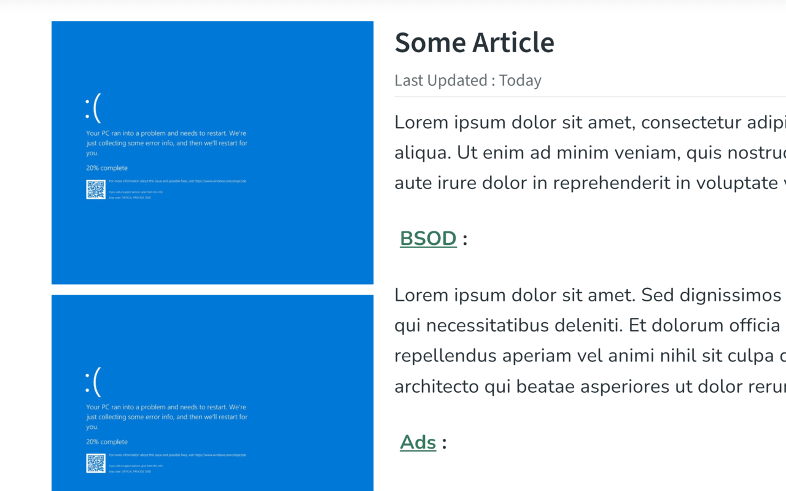

# BSOD Ads

Why ads when they can show up as a BSOD instead

Automatically replaces all ads in your page with a BSOD screen. Similar to a recent event...

*Will only work on Google Ads at the moment. There are plans for further compatibility.

